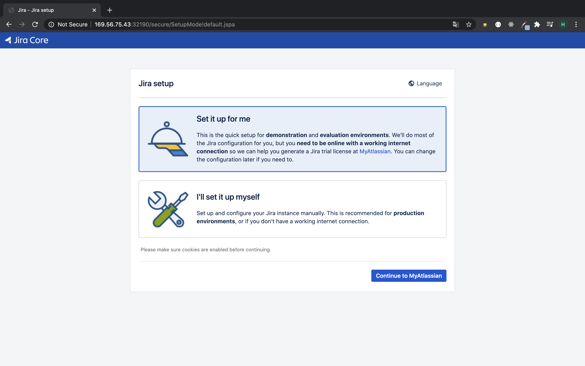

# 쿠버네티스에서 Jira 활용한 CI/CD 파이프라인 구축하기(1/3)
> Jira와 MySQL을 쿠버네티스에 올리고, Gitlab 및 Jenkins를 연동해 CI/CD 파이프라인을 구성합니다. 

## Part 1. 쿠버네티스 클러스터에 Jira 설치하기 

### 설치 환경
- IBM CLI (IKS)

쿠버네티스 클러스터 config를 설정해준 상태에서 진행합니다. IBM CLI에서 클러스터 설정에 대한 자세한 내용을 다음 [링크](https://cloud.ibm.com/docs/containers?topic=containers-cli-plugin-kubernetes-service-cli#cs_cluster_config)를 참조해주세요.

가장 먼저 Jira를 올리기 위한 네임스페이스를 생성해줍니다.
```bash
kubectl create namespace jira-cicd
```
<br>

## Steps
1. 퍼시스턴트클레임볼륨 및 퍼시스트볼륨 생성 
2. MySQL 패스워드 설정을 위한 시크릿파일 생성
3. Jira-MySQL 설치 및 초기 설정
4. Gitlab, Jenkins 연동
5. Gitlab Webhook 설정
6. Jira 이슈 생성 및 Git Commit, Build 확인 

<br>

## 1. 퍼시스턴트클레임볼륨 및 퍼시스트볼륨 생성

쿠버네티스의 pod에 이상이 생겨 재시작이 될 경우 데이터가 모두 날라갈 수 있습니다. 이런 상황을 방지하기 위해서 데이터베이스를 올릴 경우 퍼시스트볼륨을 설정해주어야 합니다. 퍼시스턴트볼륨 개념에 대한 자세한 내용은 [쿠버네티스 공식문서](https://kubernetes.io/ko/docs/concepts/storage/persistent-volumes/)를 참고하세요.

먼저 PersistentVolume을 생성합니다. volume 이름은 `jira-mysql-pv`로 지정하고, hostPath타입으로 worker node의 `/mnt/data/` 경로에 mysql 파일이 저장되도록 설정합니다. 이어서 `---` 을 두고 한 파일에 PersistentVolumeClaim을 설정합니다.  

#### jira-mysql-pv.yaml
```yaml
apiVersion: v1
kind: PersistentVolume
metadata:
  name: jira-mysql-pv
  namespace: jira-cicd
  labels:
    type: local
spec:
  storageClassName: mysql
  capacity:
    storage: 10Gi
  accessModes:
    - ReadWriteOnce
  hostPath:
    path: "/var/lib/mysql"
---
apiVersion: v1
kind: PersistentVolumeClaim
metadata:
  name: jira-mysql-pvc
  namespace: jira-cicd
spec:
  storageClassName: mysql
  accessModes:
    - ReadWriteOnce
  resources:
    requests:
      storage: 8Gi
```
작성한 yaml파일을 바탕으로 퍼시스트볼륨 및 퍼시스트볼륨클레임을 생성합니다.
```bash
kubectl create -f jira-mysql-pv.yaml
```
위와 같은 방식으로 설정값만 다르게 적용해 `jira-pv`를 생성합니다.

#### jira-pv.yaml

```yaml
apiVersion: v1
kind: PersistentVolume
metadata:
  namespace: jira-cicd
  name: jira-pv
spec:
  capacity:
    storage: 5Gi
  accessModes:
    - ReadWriteMany
  hostPath:
    path: "/var/atlassian/application-data/jira"
---
apiVersion: v1
kind: PersistentVolumeClaim
metadata:
  name: jira-pvc
  namespace: jira-cicd
spec:
  accessModes:
    - ReadWriteMany
  resources:
    requests:
      storage: 5Gi
```
작성한 yaml파일을 바탕으로 퍼시스트볼륨 및 퍼시스트볼륨클레임을 생성합니다.
```bash
kubectl create -f jira-pv.yaml
```

## 2. MySQL 패스워드 설정을 위한 시크릿파일 생성
쿠버네티스 환경에서 MySQL의 패스워드를 활용하기 위해 미리 secret 파일을 작성해줍니다. [쿠버네티스 공식문서](https://kubernetes.io/docs/concepts/configuration/secret/)를 참고했습니다. 

텍스트 파일을 불러와 `SecreteGenereator`로 `jira-mysql-pass` 를 만들어보겠습니다.

```bash
cat <<EOF >./kustomization.yaml
namespace: jira-cicd
secretGenerator:
- name: jira-mysql-pass
  literals:
  - password={YOUR_PASSWORD}
EOF
```
텍스트 파일과 `kustomization.yaml` 파일 디렉토리에서 명령을 수행합니다.
```bash
kubectl apply -k .
```

## 3. Jira-MySQL 설치 및 초기 설정

### 3.1 MySQL 인스턴스 배포
먼저 MySQL 인스턴스를 배포합니다. 

#### jira-mysql-deployment.yaml
MySQL 컨테이너 퍼시스트 볼륨을 `var/lib/mysql`에 마운트해줍니다. `MYSQL_ROOT_PASSWORD`는 시크릿에서 가져와 데이터베이스 암호로 지정합니다. 
<br>
```yaml
apiVersion: v1
kind: Service
metadata:
  name: jira-mysql
  namespace: jira-cicd
  labels: 
    name: jira
spec:
  ports:
    - port: 3306
  selector:
    name: jira
    tier: mysql
  clusterIP: None
---
apiVersion: apps/v1
kind: Deployment
metadata: 
  name: jira-mysql
  namespace: jira-cicd
spec:
  selector:
    matchLabels:
      name: jira-mysql
  strategy:
    type: Recreate
  template:
    metadata:
      labels:
        name: jira-mysql
        tier: mysql
    spec:
      containers:
      - image: mysql:5.6
        name: mysql
        env:
        - name: MYSQL_ROOT_PASSWORD
          valueFrom:
            secretKeyRef:
              name: jira-mysql-pass-[시크릿 생성시 만들어진 토큰]
              key: password
        ports:
        - containerPort: 3306
        volumeMounts:
        - name: jira-mysql-pv
          mountPath: var/lib/mysql
      volumes:
      - name: jira-mysql-pv
        persistentVolumeClaim:
          claimName: jira-mysql-pvc
```
`jira-mysql` 인스턴스를 다음 명령어로 배포합니다.
```bash
kubectl create -f jira-mysql-deployment.yaml
```
<br>
MySQL에 접속해서 데이터베이스를 생성합니다. 
먼저 default로 설정되어 있는 네임스페이스를 변경합니다.

```bash
kubectl config set-context --current --namespace=jira-cicd
```
mysql pod 이름을 확인하고, 접속해서 데이터베이스를 생성합니다.
```bash
kubectl get pods --namespace=jira-cicd
```
kubectl exec -it [mysql pod 이름] bash
```
mysql 접속하기
```bash
mysql -u root -p
Enter Password: 초기 패스워드 입력
```
mysql `jiradb` 데이터베이스 생성하기
```bash
mysql > CREATE DATABASE jiradb CHARACTER SET utf8 COLLATE utf8_bin;
exit
exit
```

### 3.2 JIRA 인스턴스 배포
다음으로 Jira 인스턴스를 배포합니다. 

#### jira-deployment.yaml
```yaml
apiVersion: v1
kind: Service
metadata:
  name: jira
  namespace: jira-cicd
  labels:
    name: jira
spec:
  ports:
    - port: 9090
      targetPort: 8080
      protocol: TCP
  selector:
    name: jira
---
apiVersion: apps/v1
kind: Deployment
metadata:
  name: jira
  namespace: jira-cicd
  labels:
    name: jira
spec:
  selector:
    matchLabels:
      name: jira
  strategy:
    type: Recreate
  template:
    metadata:
      labels:
        name: jira
    spec:
      containers:
      - image: atlassian/jira-software:latest
        name: jira
        env:
        - name: ALT_JDBC_URL
          value: jdbc:mysql://jira-mysql:3306/jiradb
        - name: ALT_JDBC_DRIVER
          value: com.mysql.jdbc.Driver
        - name: ALT_JDBC_USER
          value: root
        - name: ALT_DB_TYPE
          value: mysql
        ports:
        - containerPort: 8080
        volumeMounts:
        - mountPath: /var/atlassian/application-data/jira
          name: jira-pv
      volumes:
      - name: jira-pv
        persistentVolumeClaim:
          claimName: jira-pvc
```
다음 명령어로 쿠버네티스 클러스터에 배포합니다. 
```bash
kubectl create -f jira-deployment.yaml
```

쿠버네티스 대시보드에서 jira가 배포된 노드의 외부 주소를 확인하고, 서비스 정보를 불러옵니다.
```bash
kubectl get svc -n jira-cicd 
```
결과창은 대략 다음과 같아야 합니다.
```bash
NAME         TYPE        CLUSTER-IP       EXTERNAL-IP   PORT(S)          AGE
jira         NodePort    172.21.131.209   <none>        9090:32190/TCP   11m
jira-mysql   ClusterIP   None             <none>        3306/TCP         8h
```
앞서 확인한 ExportIP에 포트번호를 붙여 `http://ExportIPAdress:32190`으로 접속해 jira 초기 설정을 시작합니다. 



## 삭제하기 
지금까지 만든 인스턴스를 모두 삭제합니다.
```bash
kubectl delete -f jira-mysql-pvc.yaml
kubectl delete -f jira-mysql-pv.yaml
kubectl delete -f jira-pvc.yaml 
kubectl delete -f jira-pv.yaml 
```

## Reference
- kubernetes, (2020, June 08), https://kubernetes.cn/ko/docs/tutorials/stateful-application/mysql-wordpress-persistent-volume/
- Docker Hub, (2020, Jun 08), https://hub.docker.com/r/atlassian/jira-software
- Github, (2020, June 08), https://github.com/Bonn93/atlassian-kubernetes
