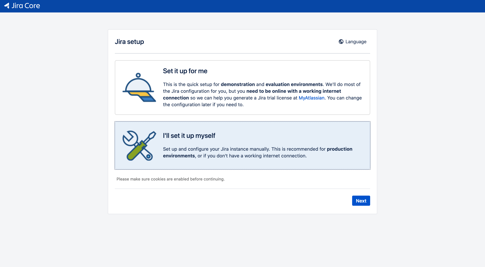
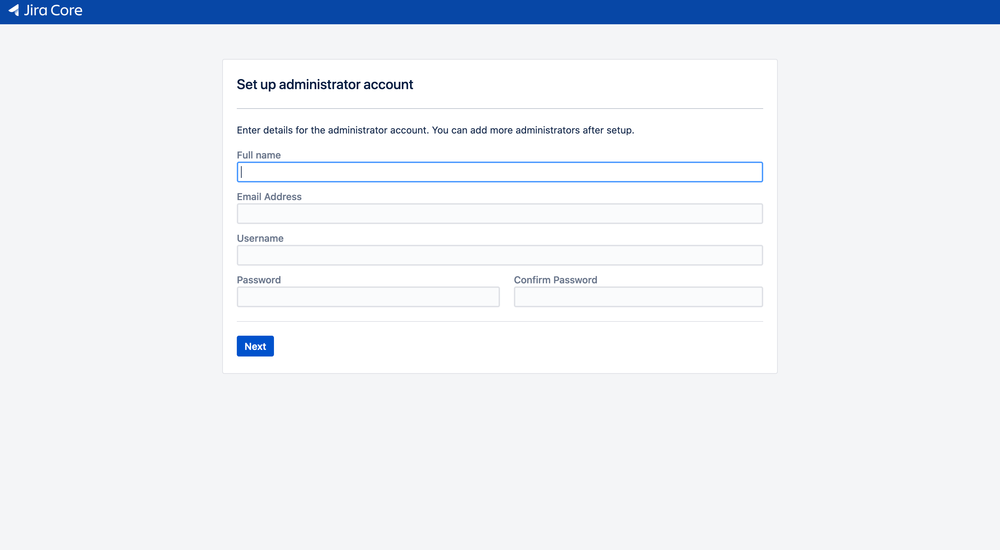

# 쿠버네티스에서 Jira 활용한 CI/CD 파이프라인 구축하기(2/3)
> Jira와 MySQL을 쿠버네티스에 올리고, Gitlab 및 Jenkins를 연동해 CI/CD 파이프라인을 구성합니다. 

## Part 2. Jira 초기 설정하기

먼저 설정 첫 화면에서 `I'll set it up myself`를 선택해 진행하겠습니다. 



앞서 설치한 mysql을 활용하기 위해 dbconfig 정보를 수정합니다. 
jira pod에 shell 접속을 시도한다.
```bash
kubectl exec -it {jira pod 이름} bash
```
vim 편집기 이용을 위해 설치한다.
```bash
apt-get update
apt-get install -y vim
```
`dbconfig.xml` 파일에 db 설정값을 집어넣습니다.
```xml
<url>jdbc:mysql://169.56.75.38:3306/jiradb?useUnicode=true&amp;characterEncoding=UTF8&amp;sessionVariables=default_storage_engine=InnoDB</url>
<username>root</username>
<password>{your password}</password>
```

jira 초기 설정 url에 접속해 자동으로 db 설정을 진행합니다. 자동 설정이 완성되면, jira software를 설치하기 위한 라이센스 등록을 진행합니다. 


테스트용 라이센스를 등록하기 위해서는 아틀라시안 계정을 생성하거나, 기존 계정에 로그인해야 합니다. 


라이센스를 발급받은 주소를 확인하면 저절로 붙여넣기가 실행됩니다. 

관리자 정보를 입력하고 설정을 완료합니다. 



사용할 언어와 아바타를 선택하고 jira 설치 과정을 마무리합니다!

