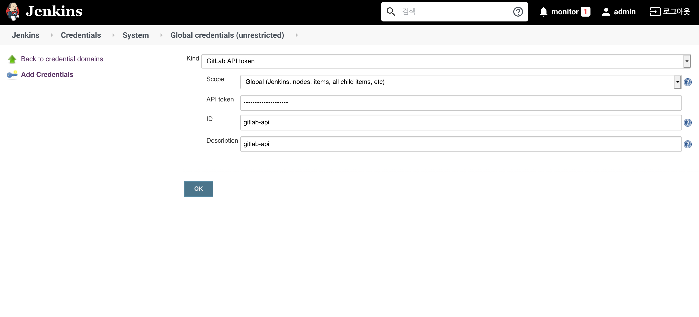
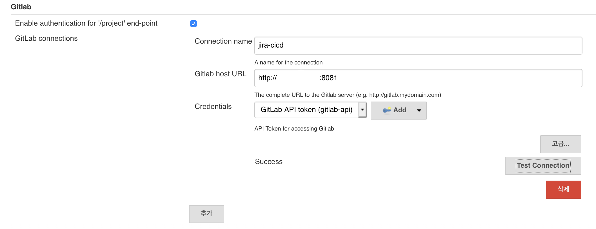
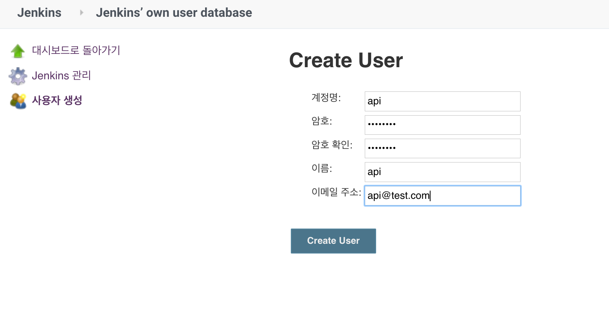
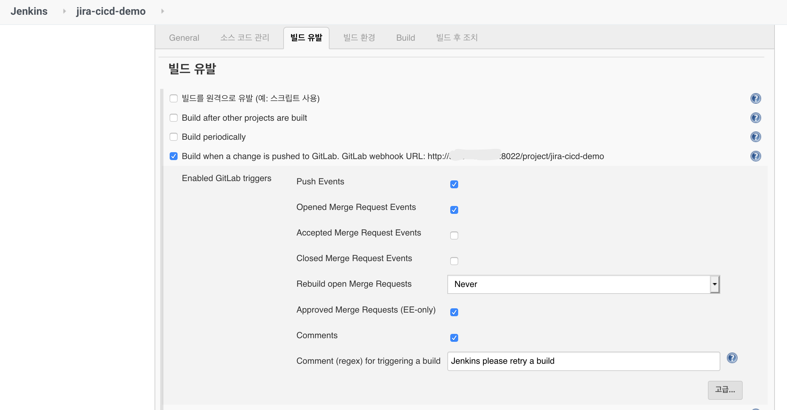
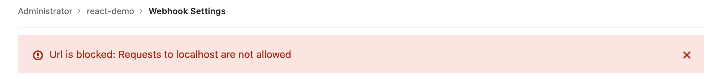
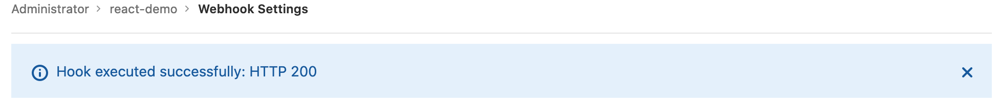
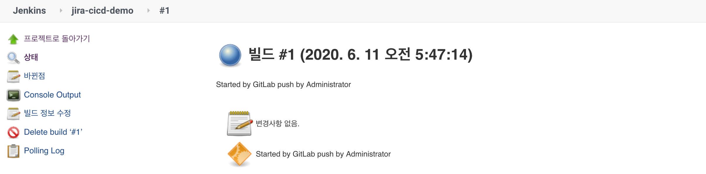

# Kubernetes(IKS)에서 Jira 활용한 CI/CD 파이프라인 구축하기(3/4)

## Part 3. Gitlab, Jenkins Webhook 연동하기
> Gitlab Repository에 이벤트 발생 시 Jenkins 자동 빌드 연동하기

## 사전 준비 사항
- [Gitlab(VM) 설치](https://velog.io/@hamon/Ubuntu18.04에-Gitlab-설치하기)
- [Jenkins(VM) 설치](https://velog.io/@hamon/Ubuntu18.04에-Jenkins-설치하기)

## 연동 환경
- Jenkins ver. 2.222.4 
- Gitlab ver. 13.0.5

## Steps
1. Jenkins Plugin 설치
2. Gitlab에서 Access Token 발급
3. Jenkins에 발급받은 Access Token을 Credential로 등록
4. Jenkins gloabl settings 에서 gitlab 설정 추가 
5. Jenkins User 생성
6. Jenkins Project 생성 및 Build Trigger 설정
7. Gitlab에 Webhook 등록

### 1. Jenkins Plugin 설치 
Gitlab 연동을 위해서는 **Gitlab**, **Gitlab Hook** Plugin 이 필요합니다. 
`Jenkins 관리 > 플러그인 관리 > 설치 가능` 에서 플러그인 목록을 확인하고 설치합니다. 

### 2. Gitlab에서 Access Token 발급
Gitlab User settings 에서 [Access Token을 발급](https://docs.gitlab.com/ee/user/profile/personal_access_tokens.html)합니다. 쓰기 권한 빼고 모든 권한을 준 뒤, 발급한 token을 복사해둡니다. 

### 3. Jenkins에 발급받은 Access Token을 Credential로 등록
이미 설치되어 있다면 바로 Jenkins에서 `Jenkins > Credentials > System > Global Credentials` 에 Gitlab 에서 만든 토큰을 `Gitlab API Token`형식으로 등록합니다. 

### 4. Jenkins gloabl settings 에서 gitlab 설정 추가 
`Jenkins > Settings` 에서 등록한 Gitlab 토큰과 url 정보를 입력합니다. 

### 5. Jenkins User 생성
Jenkins에서 Gitlab과 연동을 담당할 User를 생성합니다. 

### 6. Jenkins Project 생성 및 Build Trigger 설정
Jenkins에서 `새로운 아이템 > 파이프라인` 선택해 생성하고, Configure에서 빌드트리거를 설정합니다. 여기서 Gitlba Webhook Url: `http://gitlab.sample.com:8022/project/jira-cicd-demo`을 확인할 수 있습니다. 

### 7. Gitlab에 Webhook 등록
Gitlab에서 Settings > Webhooks 에서 webhook을 등록할 수 있습니다. 크게 id/password 방식과 secret token 방식이 있는데, 여기서는 secret token 방식을 사용하겠습니다. 
앞에서 확인한 webhook url을 입력하고, jenkins로 돌아가서 `Configure> Build Trigger` 탭에서 고급 버튼을 클릭하면 secret token을 만들 수 있습니다. 

설정을 완료하려하면 다음과 같은 에러를 마주할 수 있는데,
두가지 해결 방법을 시도해볼 수 있습니다.

먼저, Gitlab에서 `Admin area > Settings > Network > Outbound Request` 에서 체크박스를 모두 클릭하고, Jenkins url을 등록해줍니다. 

등록한 webhook에서 test 버튼을 클릭하고 push event를 발생시켜봅니다. 
연결에 성공하면 다음과 같은 메세지가 뜹니다. 

Jenkins에서도 Gitlab push로 빌드 성공했음을 확인하실 수 있습니다. 

## Reference

- TAEHWAN.KIM, (June 11, 2020), http://taewan.kim/post/bitbucket_jenkins_webhook/
- 오픈소스컨설팅, (June 12, 2020), https://tech.osci.kr/2020/01/16/86039236/