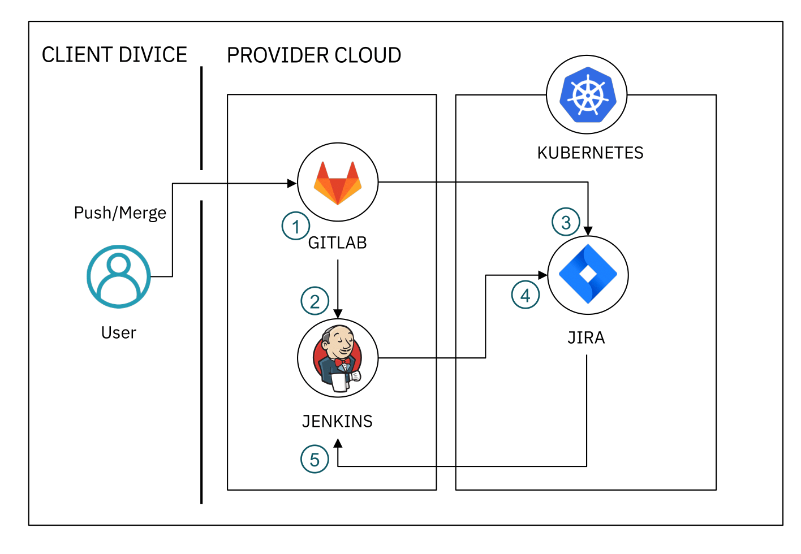

# Kubernetes(IKS)에서 Jira 활용한 CI/CD 파이프라인 구축하기(4/4)

## Part 4. Jira에서 Gitlab, Jenkins CI/CD 운영하기
> Jira Issue에 소스 커밋, 빌드 정보를 업데이트 하고, 직접 자동 빌드를 실행할 수 있게 워크플로우와 연동합니다. 

## 사전 준비 사항
- [Gitlab(VM) 설치](https://velog.io/@hamon/Ubuntu18.04에-Gitlab-설치하기)
- [Jenkins(VM) 설치](https://velog.io/@hamon/Ubuntu18.04에-Jenkins-설치하기)
- JIRA(IKS) 설치
- [Jira 프로젝트 생성 및 이슈 등록](https://velog.io/@hamon/2-Jira-프로젝트-커스터마이징-하기)

## Flow

### Features
1. Gitlab에 소스코드 수정 Commit/Merge 하기 
2. Gitlab Webhook으로 Jenkins 자동 배포하기
3. JIRA Issue에 Gitlab Commit/Merge 정보 업데이트하기
4. JIRA Issue에 Jenkins 빌드 결과 업데이트하기
5. JIRA Workflow Post Fuction 이용해 자동 배포하기 

## Steps
1. Gitlab과 Jenkins 연동하기

## 1. Gitlab과 Jenkins 연동하기

### 연동 환경
- Jenkins ver. 2.222.4 
- Gitlab ver. 13.0.5

1. Gitlab에서 Access Token 발급
2. Jenkins에 발급받은 Access Token을 Credential로 추가
3. Jenkins gloabl settings 에서 gitlab 설정 추가 
4. Gitlab에서 Webhook 생성 

## Reference

