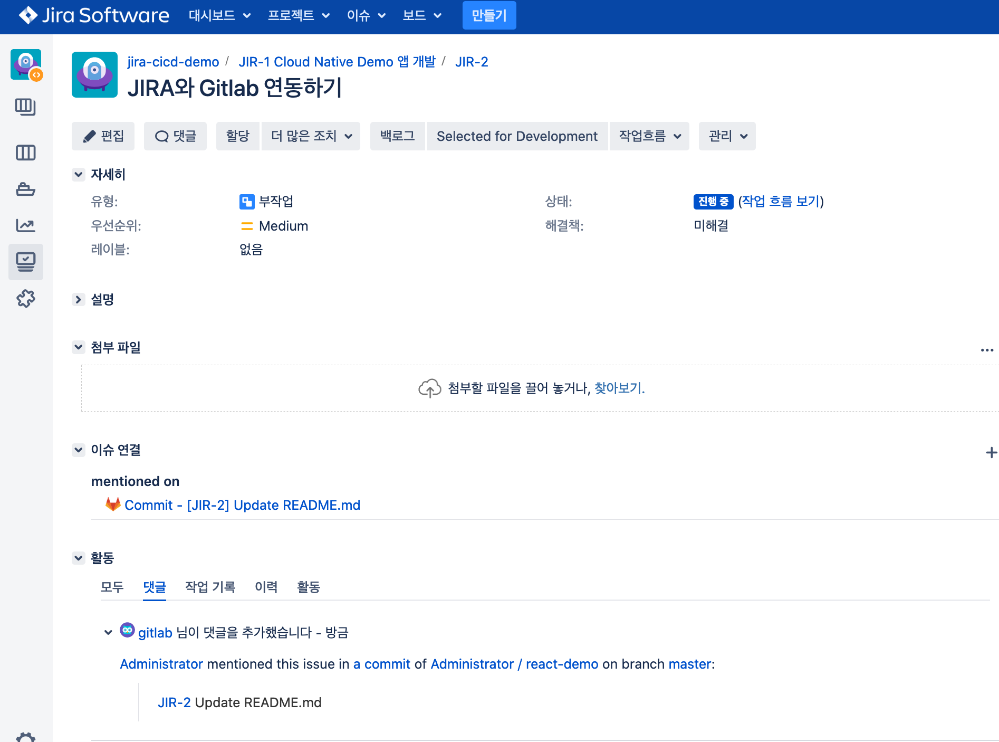
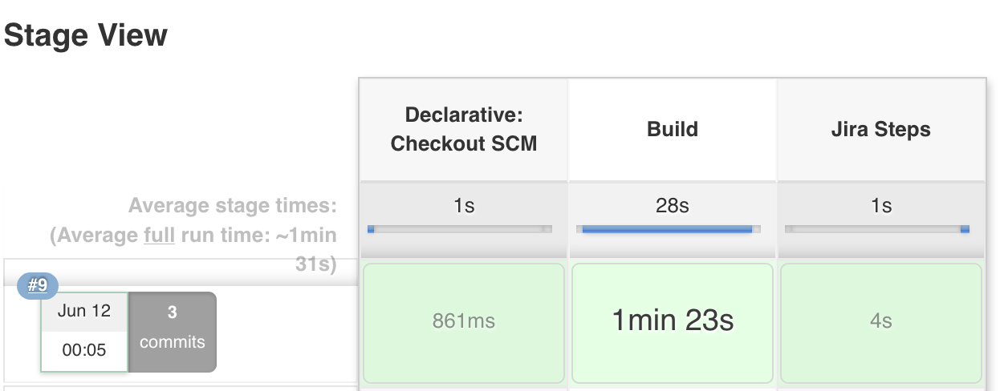
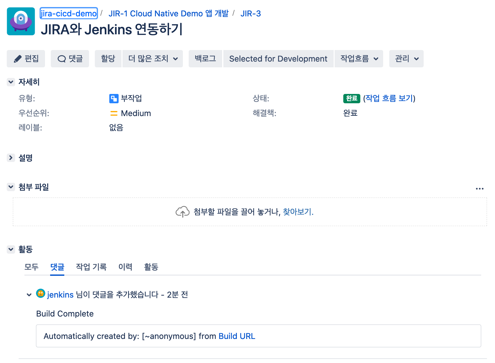
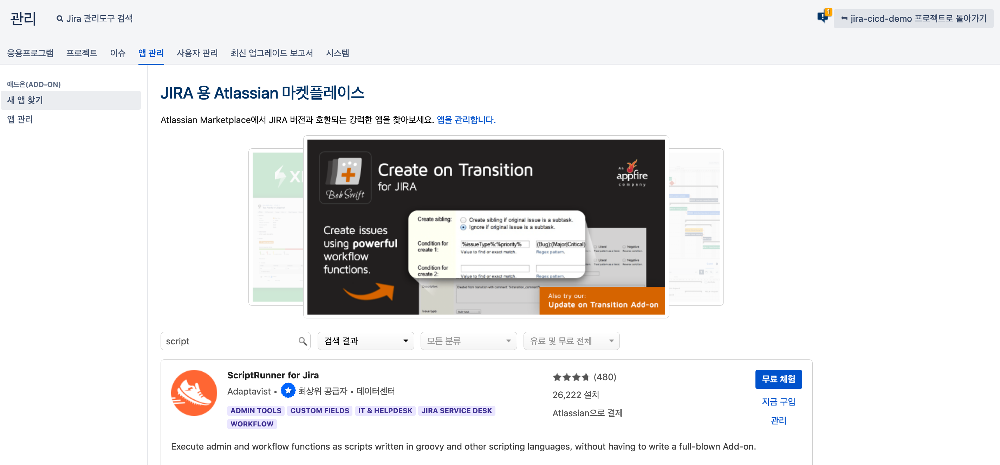
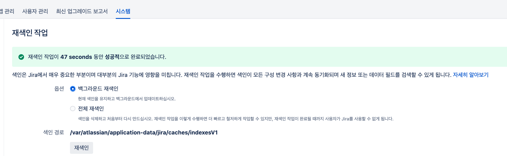
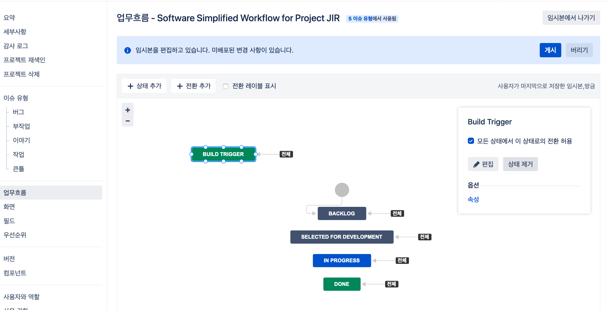
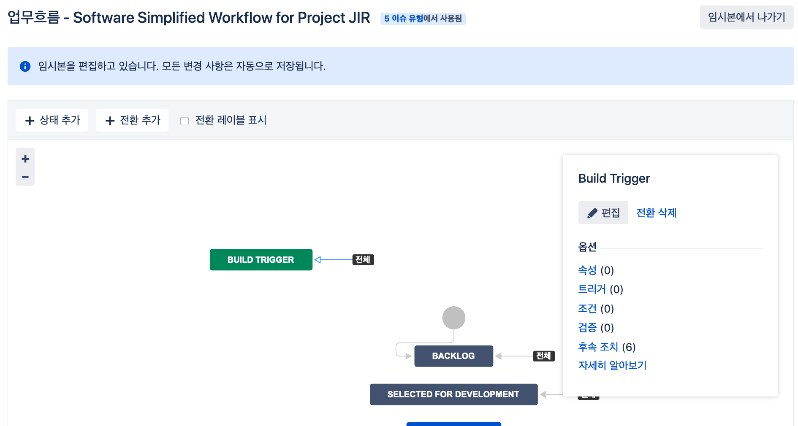
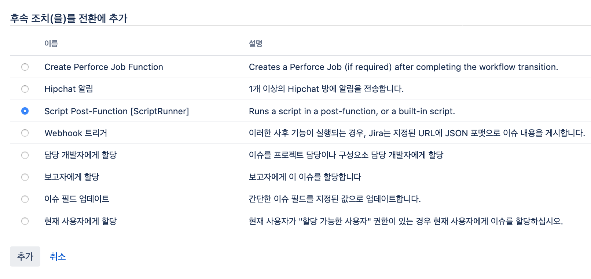

# Kubernetes(IKS)에서 Jira 활용한 CI/CD 파이프라인 구축하기(4/4)

## Part 4. Jira에서 Gitlab, Jenkins CI/CD 운영하기
> Jira Issue에 소스 커밋, 빌드 정보를 업데이트 하고, 워크플로우에서 Jenkins 자동빌드를 실행할 수 있도록 설정합니다.

## 사전 준비 사항
- [Gitlab(VM) 설치](https://velog.io/@hamon/Ubuntu18.04에-Gitlab-설치하기)
- Jenkins 설치(IKS)
- [Jira 프로젝트 생성 및 이슈 등록](https://velog.io/@hamon/2-Jira-프로젝트-커스터마이징-하기)

## Features
1. Jira Issue에 Gitlab Commit 정보 업데이트하기
2. Jira Issue에 Jenkins 빌드 결과 업데이트하기
3. Jira Workflow에서 Jenkins 자동빌드 실행하기

## Steps
1. Jira와 Gitlab 연동하기 
2. Jira에서 Jenkins 빌드 확인하기  
3. Jira Workflow에서 Jenkins 자동빌드 설정

### 1. Jira와 Gitlab 연동하기
Gitlab Project에서 `Settings > Integration` 에서 `Jira` 를 선택합니다. 
쿠버네티스에 설치한 Jira의 URL 정보와 Jira에서 Gitlab 정보를 업데이트할 때 사용할 사용자의 Username과 Password를 입력합니다. 

연동을 확인하기 위해서 Gitlab에서 Readme파일을 수정하고, Commit 메세지에 JIRA ISSUE 번호를 입력합니다.(필수) 
예시 : `[JIR-2] Update README.md`
작성한 커밋 메세지를 Push 하면 Jira Issue에서 Gitlab 변동 사항을 다음과 같이 업데이트 받을 수 있습니다. 


### 2. Jira에서 Jenkins 빌드 확인하기 
Jenkins에서 `Jira Pipeline Steps` 플러그인을 설치합니다. 
`Jenkins 관리 > 시스템 설정 > Jira Steps`에서 Jira Site 정보를 입력합니다. 


Jenkins 파이프라인 설정란에서 `Pipeline script from SCM`을 선택하고, Git 정보를 입력합니다. 
Jenkins에 Gitlab id/password Credentials를 등록해두고, 선택합니다. 디폴트로 프로젝트의 가장 상위 폴더 아래 `Jenkinsfile`에서 스크립트 파일을 읽어옵니다. 

Gitlab 프로젝트에서 Jenkinsfile을 생성하고, Jira Issue에 빌드 결과를 업데이트 하기 위한 스크립트를 작성합니다. 
참고로 Jenkins [Jira Pipeline Steps 문서](https://www.jenkins.io/doc/pipeline/steps/jira-steps/)에 스크립트 작성 사례 및 방법이 상세하게 나와있습니다.

#### Jenkinsfile
```
def JIRA_ID = "JIR-3"

pipeline {
    agent any
    stages {
        stage ('Build') {
            steps {
                sh 'yarn install'
            }
        }
        stage ('Jira Steps') {
            steps {
                script {
                    def comment = [ body: 'Build Complete']
                    jiraAddComment site: "jira", idOrKey: "${JIRA_ID}", input: comment
                }
            }
        }
    }
}
```
Jenkins 파일을 업데이트하면 앞서 Gitlab Push와 Jenkins pipeline build 연동해두었기 때문에 자동 빌드가 시작됩니다. 

다음 화면처럼 Jenkins에서 빌드가 성공하면, 이제 Jira에서도 빌드 성공 여부를 확인할 수 있습니다. 



### 3. Jira Workflow에서 Jenkins 자동빌드 실행하기

Jira에서 Jenkins에 자동빌드를 실행하기 위해서는 Jira Trigger 플러그인을 사용하면 간단하게 설정할 수 있습니다. (사용 방법은 [네이버 블로그](https://m.blog.naver.com/pooh4880/220970205734)를 참고하세요.)
다만 Jira Trigger 플러그인의 경우 Jenkins가 사용할 수 있는 포트 번호가 고정되어 있을 뿐만 아니라 SSH 인증 등 여러가지 상황에 따라 사용할 수 없는 경우가 많습니다. 
따라서 Jenkins에 직접 Build trigger를 할 수 있는 URL을 생성하고, Shell 커맨드로 Curl을 사용해 Jenkins 빌드를 실행시키는 방법을 소개하려 합니다. 

Jenkins의 `Pipeline > Settings > Build Trigger`에서 `Trigger Build Remotely`를 선택합니다. 
임의로 사용할 Token을 입력하는데, 평범한 password를 사용하기 보다는 [Randomkeygen 사이트](https://randomkeygen.com/) 등을 이용해 보안이 강화된 Token을 사용하는 것을 권장합니다. 

Jenkins에서 User를 새로 생성하고, 해당 유저의 API Token을 생성합니다. Jenkins Manage > Configure Global Security > API Token에서 `Generate a legacy API token for each newly created user`를 체크합니다. 이제 사용자 설정 탭에 들어가면 api token 을 새성할 수 있습니다. 

앞서 직접 만든 `CUSTOM_TOKEN`과 Jenkins에서 User 로그인을 위해 만든 `API TOKEN`을 조합해서 다음과 같은 url을 만들어볼 수 있습니다. 

`http://{USER_ID}:{API_TOKEN}@{JENKINS_URL}/job/jira-cicd-demo/build?token={CUSTOM_TOKEN}`

그런 다음 커멘트 창에서 POST 요청을 보내 빌드가 실행되는지 확인해봅니다. 
```bash
curl -X POST http://{USER_ID}:{API_TOKEN}@{JENKINS_URL}/job/jira-cicd-demo/build?token={CUSTOM_TOKEN}
``` 
커멘드 창에서는 실행이 되지만 Jira에서 웹훅 등록은 반드시 보안이 강화된 HTTPS 요청만 가능하기 때문에 바로 등록해서 사용하기 어렵습니다. 

따라서 직접 curl 요청을 보내는 방식으로 연동해보겠습니다.
Jira 용 Atlassian 마켓플레이스에서는 다양한 앱을 제공하고 있고, 그 중에서 Script를 직접 작성해서 workflow postfunction에 활용할 수 있는 `ScriptRunner for Jira`를 다운받아 사용했습니다. 


플러그인 설치 후에는 반드시 재색인을 수행해주어야 Jira에서 추가된 기능을 사용하실 수 있습니다. 


이제 script 작성을 workflow 에 적용하기 위해 먼저 빌드 트리거용 status를 하나 만들어보겠습니다. 

이런 식으로 원하는 status를 만들고, 해당 status로 전환하면서 post function을 발생시키는데, 이 때 script가 실행되도록 action을 설정할 수 있습니다 


후속 조치(post function)를 클릭하고 들어가 후속 조치를 추가합니다.


script으로 post function을 추가할 수 있는 탭이 새로 생긴 것을 확인하실 수 있습니다.
클릭해서 들어가고, `Custom script post-function`을 사용해 스크립트를 작성합니다. 

```groovy
def proc = 'curl -v -k -X POST http://{USER_ID}:{API_TOKEN}@{JENKINS_URL}/job/jira-cicd-demo/build?token={CUSTOM_TOKEN}'.execute()

Thread.start { System.err << proc.err }
proc.waitFor()
```
JIRA 이슈에서 Build Trigger 전환 버튼을 누르고, Jenkins 자동빌드되는 것을 확인합니다.

ScriptRunner의 경우 유료로 구매해서 사용해야합니다. 스크립트를 비교적 자유롭게 작성할 수 있는 장점이 있지만, 빠른 시간 내에 SSL인증 없이 연동을 완성해야하는 등의 특수한 경우가 아니라면 가급적 JIRA에서 제공하는 웹훅 기능을 활용하시길 권장합니다. 앞서 curl 명령어로 요청을 날린 빌드 트리거 URL의 경우, JIRA 웹훅으로 등록해서도 Workflow Post Function으로 사용할 수 있습니다. 


## Reference
- Jenkins, (June 12, 2020), https://www.jenkins.io/doc/pipeline/steps/jira-steps/
- HumanWhoCode, (June 12, 2020), https://humanwhocodes.com/blog/2015/10/triggering-jenkins-builds-by-url/
- StackOverFlow, (June 12, 2020), https://stackoverflow.com/questions/23742419/perfectly-working-curl-command-fails-when-executed-in-a-groovy-script
